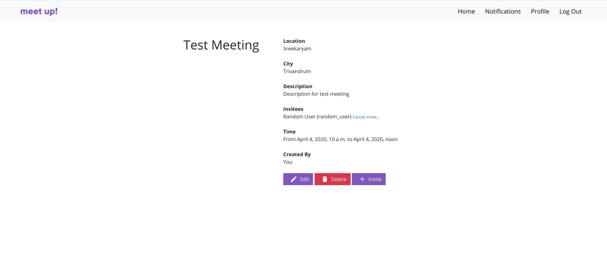

# meeting-scheduler
<p align="center">
  
</p>
A webapp made using Django Framework to schedule meetings, appoinments etc.

# Setting up the environment
## Setting up virtual environment
To create an virtual environment, run the following command in a Terminal
```
python3 -m venv meeting-scheduler
```
This will create an meeting-scheduler directory.

## Cloning the repository
Activate the virtual environment by running  
In Linux:
```
source bin/activate
```  
In windows:
```
bin\activate
```
  
Now clone the git repository to the folder by running:
```
git clone https://github.com/gkdskp/meeting-scheduler.git
```

## Installing requirements
Install all the requirements for the project by running
```
cd meeting-scheduler
sudo pip3 install -r requirements.txt
```

## Making migrations

To migrate run
```
python3 manage.py migrate
```

## Running the server
To run the server, execute
```
python3 manage.py runserver
```
