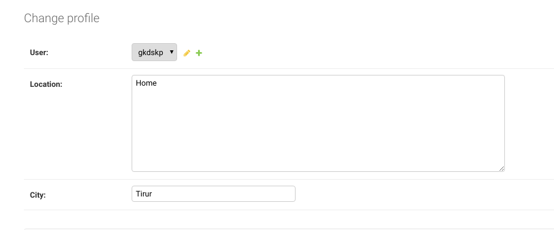
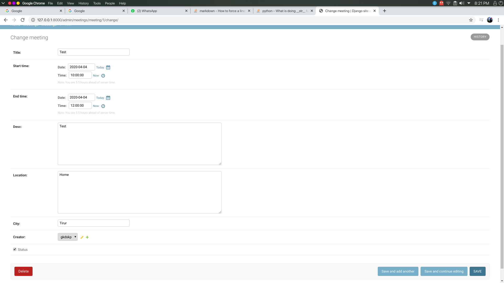
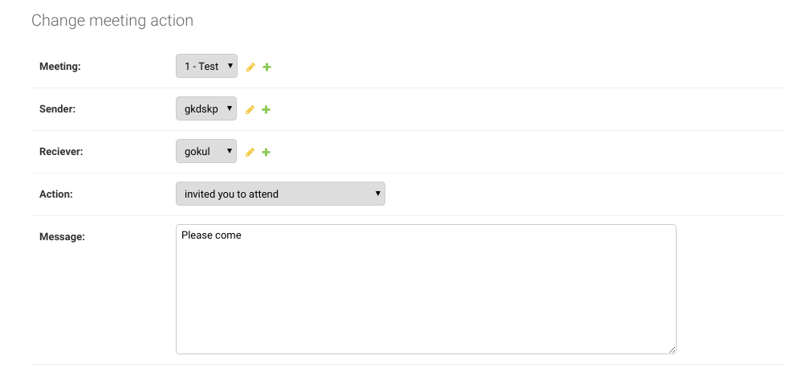

# Database Design
Django has an in-built [ORM](https://stackoverflow.com/questions/1279613/what-is-an-orm-how-does-it-work-and-how-should-i-use-one)
which lets the users to access data from database as objects in Python.
  
    
## Models
> A model is the single, definitive source of information about your data. It contains the essential fields and behaviors 
> of the data you’re storing. Generally, each model maps to a single database table.
  
### User model
An in-built User model is available in Django located as django.contrib.auth.models.User. It has the following fields
* __username__
* __first_name__ (optional)
* __last_name__ (optional)
* __email__ (optional)
* __password__ (required. Django provides a flexible password storage system and uses PBKDF2 by default.)
among others

<br/>

### Profile model
(Specified in [users/models.py](../users/models.py))  
Profile model is used to extend the User model and store extra details about the user.

The fields specified in Profile model:
* __user__  
  A OneToOneField that is used to specify the user the profile belongs to   
* __location__  
   A TextField that is used to store the location of the user, max_length=500, blank=False)
* __city__  
   A TextField that is used to store the current city of the user, max_length=50, blank=False)
* __last_notif_check__  
   A DateTimeField that automatically updates to current time when the profile is updated (auto_now=True)
* __``__str__``__ method  
   Returns the default name of each record as seen in the Django admin panel


Example Profile:

 

<br/>
  
### Meeting model
(Specified in [meetings/models.py](../meetings/models.py))  
Meeting model is used to store the details of each meeting.  

Fields:  
 * __mid__  
   An AutoField (automatically incrementing primary_key)   
* __title__  
   A TextField that is used to store the title of the meeting (max_length=50, blank=False)
* __start_time__  
   A DateTimeField that is used to store the starting time of a meeting
* __end_time__  
  A DateTimeField that is used to store the ending time of a meeting
* __create_time__  
  A DateTimeField which automatically stores the current time whenever a new meeting is created (auto_now_add=True)
* __last_edit_time__  
  A DateTimeField which automatically stores the current time whenever a meeting is edited or updated (auto_now=True)  
* __desc__  
   A TextField that is used to store the description of the meeting(max_length=500, blank=False)  
* __location__  
   A TextField that is used to store the location of the meeting, max_length=500, blank=False)
* __city__  
   A TextField that is used to store the city of the meeting, max_length=50, blank=False)
* __creator__ 
   A ForeignKey to store the user that created the meeting (on_delete=models.CASCADE, null=True)
* __status__  
   True if an meeting is active, False if it is deleted.  
* __``__str__``__ method  
   Returns the default name of each record as seen in the Django admin panel  
* __delete__ method  
  Overrides the Django delete method. Instead of deleting the record it sets the status of the meeting to False and creates a record in MeetingAction table to notify the participants that the event has been cancelled.  


Example Meeting:


<br/>

### MeetingAction 
(Specified in [meetings/models.py](../meetings/models.py))  
MeetingAction model is used to store actions people take on a meeting. It is the model responsible for sending people notifications

Fields:  
* __meeting__  
   A ForeignKey to store the meeting that the action is taken on (on_delete=models.CASCADE, null=True)
* __action__   
  The choice taken on the meeting. It is a SmallIntegerField with choices given below.
  ```
  1 => Invited someone to attend a meeting (only creator of a meeting can send this action)
  2 => Accepted an invite (only invitees of a meeting can send this action)
  3 => Declined an invite (only invitees of a meeting can send this action)
  4 => Sent an personal message (only invitees of a meeting can send this action)
  5 => Deleted the meeting (only creator of a meeting can send this action)
  ```
* __sender__  
  A ForeignKey to store the user who took the action (on_delete=models.CASCADE, null=True)
* __reciever__  
  A ForeignKey to store the user whom the action is concerned. The recievers of an action will recieve the notifications (on_delete=models.CASCADE, null=True)
* __message__  
  A TextField storing a message regarding the action took
* __decision_time__  
  Time the user sends the action
* __``__str__``__ method  
   Returns the default name of each record as seen in the Django admin panel

Example MeetingAction:
