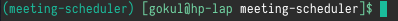

# Setting up the environment
## Setting up virtual environment
To set up an development environment create an python virtual environment. Virtual environments handles the packages and modules that are required in a python project so that no conflicts arises with other python applications.
To create an virtual environment, run the following command in a Terminal
```
python3 -m venv meeting-scheduler
```
This will create an meeting-scheduler directory.

## Cloning the repository
Each time you work with the application you may need to activate the virtual environment created. To do so open the meeting-scheduler directory and run:  
In Linux:
```
source bin/activate
```  
In windows:
```
bin\activate
```
When activated the name of the virtual environment will be displayed in terminal as seen in the picture  
    
  
Now clone the git repository to the folder by running:
```
git clone https://github.com/meeting-scheduler/meeting-scheduler-temp.git
```

## Installing requirements
Install all the requirements for the project by running
```
cd meeting-scheduler-temp
sudo pip3 install -r requirements.txt
```

## Making migrations

To make migrations run
```
python3 manage.py makemigrations
python3 manage.py migrate
```

## Running the server
To run the server, execute
```
python3 manage.py runserver
```
Now if you open the link as specified in the output in a web browser you may see the following page


Now you can start editing the source files